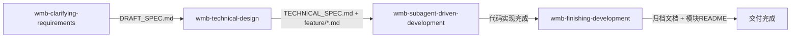

# 开发收尾：规格对齐与模块文档

## 概述

在 wmb-subagent-driven-development 完成所有功能点的实施与审查后，执行整体的规格对齐检查和模块文档产出。本 skill 进行的是**跨功能点的全局对齐** — 检查整体实现是否与 DRAFT_SPEC（需求规格）和 TECHNICAL_SPEC（技术方案）一致，而非单个功能点的局部检查，因此需要考虑功能点之间的功能修改是否有互相影响。

**Announce at start:** "我正在使用 wmb-finishing-development skill 来完成开发收尾：规格对齐检查和模块文档产出"

## 术语定义


| 术语 | 定义 | 对应产物 |
|------|------|---------|
| **功能点** | 产品维度的独立模块，能独立向用户交付价值 | 一个 `feature/xxx.md` 文件 |
| **任务** | 功能点内的实现步骤 | feature 文件中的"任务 1"、"任务 2"... |


## 核心原则

- **一次一个问题** - 不要用多个问题压倒用户，如果需要深入探索，将复杂问题分解为多个简单问题，**必须逐个确认，不可以同时提多个**
- **多选优于开放** - 尽可能提供选择题而非开放式问题，降低回答难度
- **证据先行**：所有漂移判定必须基于实际代码对比，不可凭记忆或推测
- **全部确认**：所有漂移项（无论 BLOCKING 还是 SUGGESTION）都必须经用户确认后才能修正，不得自行决定修改
- **不改代码**：本 skill 只修改文档，不修改任何实现代码。如发现需要代码修改，记录到报告中交由用户决定
- **归档意识**：修正后的文档应准确反映"实际做了什么"，而非"原来计划做什么"
- **全量 README**：本次涉及的所有组件/页面目录都应检查 README 状态，无则创建、有则更新
- **绝对复制**：README 编写场景**只能使用** `cp` 命令复制模板，不可直接编写

## 执行流程

### 阶段一：规格漂移检测与对齐

#### 1.1 用户确认与信息收集

**STOP — 向用户确认以下问题，等待回复后才能继续。不得自行搜索文件或读取代码。**

向用户提出以下问题：
1. 本次收尾针对哪个功能？请提供设计文档目录路径（如 `docs/design/YYYY-MM-DD-功能名/`）

**在用户提供上述信息之前，不得执行任何文件搜索、文件读取或代码探索操作。**

用户确认后，开始信息收集：

```markdown
**读取规格文档**（使用用户提供的路径）:
- 读取 DRAFT_SPEC.md/DRAFT.md（需求规格）
- 读取 TECHNICAL_SPEC.md/TECHINCAL.md（技术方案）
- 读取所有 feature/*.md（功能点文档）

**探索实现代码**:
- 根据 TECHNICAL_SPEC 中的目录结构和文件清单，逐一确认文件是否存在
- 读取关键实现文件，理解实际代码结构
- 注意：不需要逐行审查代码质量，聚焦于"做了什么"而非"做得好不好"
```

#### 1.2 漂移分类与分析

**核心判定原则**:
参考 [spec-drift-detection-guide.md](references/spec-drift-detection-guide.md) 

**执行步骤**:
1. 检查DRAFT_SPEC中的每个功能点是否已实现
2. 检查TECHNICAL_SPEC中的每个文件是否存在
3. 检查feature/*.md中的每个任务是否完成
4. 检查代码中是否有文档未提及的重要功能

Controller 自己执行，不派遣 subagent。

基于 DRAFT_SPEC 和 TECHNICAL_SPEC 的功能点列表，构建覆盖矩阵：

```markdown
| 需求项 | DRAFT_SPEC 要求 | TECHNICAL_SPEC 设计 | 实际实现 | 状态 |
|--------|----------------|-------------------|---------|------|
| 功能点A | ✅ 描述... | ✅ 设计... | ✅ 已实现 | ✅ 对齐 |
| 功能点B | ✅ 描述... | ✅ 设计... | ⚠️ 部分实现 | ⚠️ 漂移 |
| 功能点C | ❌ 未提及 | ❌ 未设计 | ✅ 已实现 | ➕ 额外实现 |
```

#### 1.3 用户确认与文档修正

**所有漂移项（无论 BLOCKING 还是 SUGGESTION）都必须经用户确认后才能修正。**

**关键规则**（不可违反）：
- 优先展示 BLOCKING，**不得**一次展示多项，**不得**一次提问多个问题
- BLOCKING 项：逐项确认，每项**必须附结构化选项**（A/B/C），**禁止开放性问A题**
- SUGGESTION 项：批量展示，用户可选"全部同意"或"逐项审查"
- 用户确认前**不得执行任何文档修正**

**漂移处理统一模板**（BLOCKING 和 SUGGESTION 通用）：

```markdown
🚫/⚠️ **漂移 X: [标题]**

**证据**:
- DRAFT/TECHNICAL_SPEC 要求: [具体内容]
- 实际实现: [具体内容]

**影响**: [说明影响]

**处理方式**:
- A. 接受现状，修正文档（DRAFT/TECHNICAL_SPEC 归档）
- B. 较大改动 → `/wmb-technical-design` → `/wmb-subagent-driven-development` → 重新执行本 skill
- C. 较小改动 → 直接修改代码 → 重新执行本 skill

**您选择: A / B / C **
```

**说明**:
- BLOCKING 漂移使用 🚫 标记
- SUGGESTION 漂移使用 ⚠️ 标记
- 无论选择 B 或 C，完成代码修改后都应重新执行本 skill 完成归档

#### 1.4 文档修正与归档

用户确认后，执行文档修正：

```markdown
**修正范围**:
- 更新 DRAFT_SPEC.md 中与实际不符的描述、完成状态
- 更新 TECHNICAL_SPEC.md 中的架构、文件清单、技术方案描述、完成状态
- 更新 feature/*.md 中的任务状态和实现细节

**归档标记**:
在 DRAFT_SPEC.md/TECHNICAL_SPEC.md 顶部添加完成标记：

---
**开发状态**: ✅ 已完成
**对齐检查**: YYYY-MM-DD
**实际实现说明**: [如有整体偏离说明写在这里，没有则写"与原方案基本一致"]
---

**提交**:
git add docs/design/YYYY-MM-DD-<功能名称>/
git commit -m "docs: <功能名称>开发收尾 - 规格对齐与文档修正"
```

### 阶段二：模块 README 产出

#### 2.1 识别需要 README 的模块

```markdown
**识别规则**:
- 检查所有功能点（TECHNICAL_SPEC + feature/*.md）涉及的文件清单
- 收集所有涉及修改或新建的组件/页面目录（不论修改幅度大小）
- 排除：纯工具函数文件、配置文件、类型定义文件
- 聚焦：有独立业务含义的模块目录（组件、页面、业务逻辑模块）

**对每个模块目录检查 README 状态**:
- 无 README → 标记为"新建"，基于当前代码现状创建
- 有 README → 标记为"更新"，检查是否需要补充本次功能点信息

**输出待写 README 列表**:
- [ ] [新建] src/components/[ComponentA]/README.md
- [ ] [更新] src/components/[ComponentB]/README.md
- [ ] ...

**收集设计文档信息**:
- 记录本次涉及的功能点文档路径（用于填写"设计文档"章节）
- 如果模块已有 README，读取现有的"设计文档"章节，合并新旧功能点（最多保留 5 个）
```

#### 2.2 为每个模块编写 README

**必须使用 subagent **，并行编写多个模块的 README。见 [readme-writer-prompt.md](references/readme-writer-prompt.md)。

**编写方式**：**必须使用** `cp` 命令复制 [MODULE_README_template.md](assets/MODULE_README_template.md) 模板，然后**严格按照文档格式填充**。

**核心要求**：
- ✅ 绝对复制：**只能使用** `cp` 命令复制模板，不可直接编写
- ✅ 严格填空：按模板格式填充，不可改变结构
- ✅ 基于实际代码：填入的内容必须基于实际读取的代码

#### 2.3 提交 README

```bash
git add [所有新增的 README 文件]
git commit -m "docs: <功能名称>模块 README 文档"
```

## 与其他技能的集成



**上游技能**: wmb-subagent-driven-development（提供已完成的代码实现）
**输入文档**: DRAFT_SPEC.md, TECHNICAL_SPEC.md, feature/*.md
**输出产物**: 修正后的规格文档 + 模块 README 文件

## Red Flags

**Never:**
- 在用户确认收尾目标之前就开始搜索文件或读取代码
- 自行决定任何漂移项的处理方式（无论 BLOCKING 还是 SUGGESTION，都必须用户确认）
- 使用开放性问题提问（必须提供结构化选项 A/B/C）
- 以"修改幅度小"为理由跳过某个组件的 README 检查
- 在 README 中写大段代码或技术实现细节
- 修改任何实现代码（只改文档）
- 跳过阶段一直接写 README（规格对齐是前提）
- 对漂移项做"合理化"推测（如"可能是故意的"）— 必须基于证据判定
