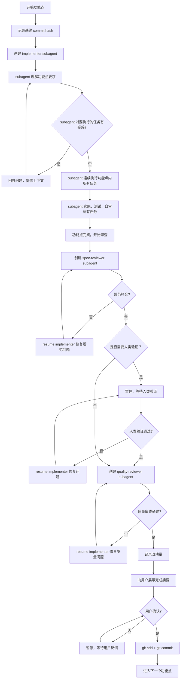

# WMB subagent-Driven Development

Execute plan by dispatching fresh subagent per feature, with continuous task execution and two-stage review: spec compliance review first, then code quality review.

**Announce at start:** "我正在使用 wmb-subagent-driven-development skill 来执行技术方案实施"

**Skill 目录约定**: 本 skill 的脚本和引用文件位于 SKILL.md 同级目录下（`scripts/`、`references/`），执行脚本时使用**本 skill 的绝对路径**，而非项目工程目录。

## 术语定义

**功能点（Feature）**:

- 对应一个独立的 feature 文档（如 `feature/用户登录.md`）
- 提供完整的用户价值
- 是审查的基本单位

**任务（Task）**:

- feature 文档内的实施步骤（如任务 1、任务 2、任务 3...）
- 多个任务共同完成一个功能点
- 不单独进行审查，而是在功能点完成后统一审查

**执行原则**:

- 按 feature 文档连续执行所有任务
- 完成整个 feature 后进行双重审查
- 每个 feature 完成后检查人类验证点

## 执行前检查清单

开始执行前必须确认：

- [ ] 已理解：**一个功能点 = 一个 implementer + 一个 spec-reviewer + 一个 quality-reviewer**
- [ ] 已理解：同一功能点的所有修复都复用同一个 implementer（通过 resume）
- [ ] 已理解：TaskList 仅用于进度跟踪和上下文组织，不是 subagent 分配依据
- [ ] 已理解：subagent 需要连续执行功能点内的所有任务，保持上下文连续性
- [ ] 已准备：功能点的完整上下文和所有任务描述
- [ ] 已验证：主规范文档的文件清单要求已完整覆盖

## 核心原则

### 设计理念

- **上下文隔离**：每功能点独立 subagent，避免上下文污染和混淆
- **信息前置**：Controller 精心策划上下文，提供完整信息给 subagent，无需 subagent 自己读取文件
- **问题前置**：疑问在工作开始前解决，而不是事后返工
- **质量分层**：先规范符合（做对事），再代码质量（做好事）

### 执行约束

- **Controller 禁止直接修改代码**：所有代码修改必须通过 subagent 完成，避免上下文污染
- MUST FOLLOW **一个功能点 = 固定的 subagent 组合**：1 个 implementer + 1 个 spec-reviewer + 1 个 quality-reviewer
- **Resume 复用原则**：同一功能点的所有修复都复用同一个 implementer（通过 resume）
- **功能点级审查**：完成整个功能点的所有任务后，才进行双重审查
- **人类验证优先**：spec-review 通过后，先人类验证，再 quality-review

### 审查机制

- **Self-review**：implementer 在提交前自审，减少低级错误
- **Spec compliance first**：防止过度实现或遗漏需求（做对事）
- **Code quality second**：确保实现质量（做好事）
- **Review loops**：发现问题 → resume implementer 修复 → 重新审查，直到通过
- **双重保障**：规范审查防止做错事，质量审查确保做好事

## 执行流程

### 1. 初始化阶段

```markdown
**读取计划**:

- 读取主计划文档（如 TECHNICAL_SPEC.md）
- 识别所有功能点和对应的子文档
- 读取每个功能点文档，获取完整内容

**提取任务**:

1. 从每个功能点文档中提取所有任务
2. 为每个任务保留功能点上下文和整体架构信息
3. **规范符合性验证**:
   - 仔细对比主规范文档的目录结构和文件清单要求
   - 识别功能点任务中未覆盖的必需文件
   - 为遗漏的文件补充创建/修改任务
   - 确保所有技术要求都有对应的实施步骤
4. **完整性确认**:
   - 输出完整的文件清单对比表
   - 确认所有必需文件都有对应任务
   - 验证任务分解的完整性
5. 创建完整的 TaskList，按功能点分组排列
6. 明确标识哪些任务属于同一功能点

**重要说明**: TaskList 仅用于进度跟踪和上下文组织，不代表每个 Task 需要独立的 subagent。一个功能点的所有任务由同一个 implementer subagent 连续完成。
```

### 2. 每个功能点的执行循环

**必须遵循该开发流程，不允许在没有进行 spec-review 及 quality-reviewer 开始下一次开发**

- 每个功能点**开始前**，Controller 记录基线 commit hash：执行 `git rev-parse HEAD` 并保存结果（记为 `BASELINE`）
- 每个功能点**双重审查通过后**，按以下顺序收尾：

**① 记录改动量**（**严禁**手动写入 `changes.json`，必须执行脚本）：

```bash
node <SKILL_DIR>/scripts/record-changes.js \
  --design-dir "docs/design/YYYY-MM-DD-<需求名称>" \
  --feature "<功能点名称>" \
  --base "<BASELINE commit hash>" \
  --changes "改动点1" "改动点2" "改动点3"
```

> `<SKILL_DIR>` 为本 SKILL.md 所在目录的绝对路径。

**② 向用户展示改动摘要，确认后执行 git commit**：

```bash
git add .
git commit -m "feature(<功能点名称>): <一句话描述>"
```

> 用户不确认则暂停，等待反馈后再继续。



## 完成后的行动

**确认完成状态**:

- 所有功能点都通过了 spec-review 和 quality-review
- 所有人类验证点都已通过

**下一步 (如果用户继续)**:

- 询问："所有功能点已完成，准备好进行开发收尾了吗？"
- 使用 wmb-finishing-development skill 进行：
  - 规格漂移检测与文档归档
  - 模块 README 文档生成

## subagent 模板

### implementer subagent

**执行流程**:

1. **理解阶段**：先全面理解功能点要求和所有任务，提出疑问
2. **确认阶段**：与 controller 澄清所有疑惑，确保理解正确
3. **执行阶段**：连续完成功能点内的所有任务，保持上下文连续性

**职责**:

- 接收：完整的功能点上下文 + 所有任务列表
- 理解：在开始执行前，充分理解所有要求并澄清疑惑
- 执行：连续完成功能点内的所有任务，保持上下文连续性
- 输出：完整功能点的实现结果
- 禁止：未充分理解就开始执行，或任务间的上下文中断

### implementer subagent 初始化指南

见 [implementer-prompt.md](references/implementer-prompt.md)

### spec-review subagent 初始化指南

见 [spec-reviewer-prompt.md](references/spec-reviewer-prompt.md)

### quality-reviewer subagent 初始化指南

见 [code-quality-reviewer-prompt.md](references/code-quality-reviewer-prompt.md)

## 人类验证处理

当功能点包含 "🔍 **需要人类搭档验证**" 节点时：

```markdown
**暂停执行，通知人类**:
"功能点 [功能点名称] 技术实现完成，需要人类验证以下内容：

- [具体验证项目 1]
- [具体验证项目 2]
- [具体验证项目 3]

请验证后反馈：

- ✅ 验证通过 - 继续下一步
- ❌ 需要调整 - 请描述具体问题"
```

**根据反馈处理**:

- 通过 → 继续代码质量审查
- 需要调整 → 派遣修复 subagent，然后重新人类验证

## Controller 行为约束

**核心原则：Controller 禁止直接修改代码**

为了保持上下文清晰、避免 context pollution，所有代码修改必须通过 subagent 完成。

### subagent 管理规则

**一个功能点 = 固定的 subagent 组合：**

- 1 个 implementer subagent（所有实现和修复）
- 1 个 spec-reviewer subagent（所有规范审查）
- 1 个 quality-reviewer subagent（所有质量审查）

**复用原则：**

- 正常流程中的修复（reviewer 问题、人类反馈）→ **resume** 同一个 subagent
- 这保证了干净的上下文：subagent 了解之前的决策和代码结构
- 只有两种情况创建新 subagent：
  1. 功能点切换时
  2. subagent 完全失败时（异常情况，需要全新上下文尝试）

### 代码修改职责表

| 场景                    | 正确做法                      | 说明                     |
| ----------------------- | ----------------------------- | ------------------------ |
| 计划中的任务            | 派遣 implementer subagent     | 新功能点开始             |
| Reviewer 发现问题       | **resume** 同一个 implementer | 正常流程，保持上下文     |
| 人类验证反馈"需要调整"  | **resume** 同一个 implementer | 正常流程，保持上下文     |
| 用户中途提出新需求/改进 | **resume** 同一个 implementer | 视为功能点追加任务       |
| **subagent 完全失败**   | 派遣新的 fix subagent         | 异常情况，需要全新上下文 |

### Controller 职责边界

- ✅ 读取和分析代码（准备 subagent 上下文）
- ✅ 编排和协调 subagent
- ✅ 与用户沟通、澄清需求
- ✅ 审查 subagent 的输出
- ❌ 直接编辑任何代码文件
- ❌ 自己"顺手"修复小问题

## Red Flags

**Never:**

- Controller 直接修改代码（必须通过 subagent，管理上下文）
- 跳过任何审查环节（spec compliance OR code quality）
- 同时派遣多个 implementer subagent（会冲突）
- 让 subagent 读取计划文件（应直接提供完整文本）
- 忽略 subagent 的问题
- 在规范审查通过前开始代码质量审查（顺序错误）
- 在功能点未完成时进行审查（必须等所有任务完成）
- 跳过 review 循环（reviewer 发现问题 → implementer 修复 → 再次 review）

**If subagent asks questions:**

- Answer clearly and completely
- Provide additional context if needed
- Don't rush them into implementation

**If reviewer finds issues:**

- **Resume** same implementer to fix（保持上下文）
- Reviewer reviews again
- Repeat until approved
- Don't skip the re-review

**If subagent fails task completely:**

- Dispatch **new** fix subagent with specific instructions
- Don't try to fix manually (context pollution)

## 与其他技能的集成

**常用的上游技能**:

- **wmb-technical-design** - 可生成本技能执行的技术方案

## 示例工作流

```
Controller: 我正在使用 wmb-subagent-driven-development skill 来执行技术方案实施

[读取主文档: docs/design/2024-01-15-user-profile/TECHNICAL_SPEC.md]
[识别功能点: user-avatar-component, user-profile-form, user-settings]
[读取功能点文档: user-avatar-component.md, user-profile-form.md, user-settings.md]
[从所有功能点文档中提取任务，创建 TaskList]

提取的 TaskList:
- Task 1: 创建用户头像组件基础结构 (来自功能点: user-avatar-component)
- Task 2: 实现头像加载状态和错误处理 (来自功能点: user-avatar-component)
- Task 3: 创建用户信息表单组件 (来自功能点: user-profile-form)
- Task 4: 实现表单验证逻辑 (来自功能点: user-profile-form)
- Task 5: 创建用户设置页面 (来自功能点: user-settings)

功能点: user-avatar-component

[记录基线: git rev-parse HEAD → abc1234]
[派遣实施 subagent，提供完整功能点上下文 + 所有任务列表]

Implementer: "我需要理解整个功能点的要求。我看到需要完成两个任务：
1. 创建用户头像组件基础结构
2. 实现头像加载状态和错误处理

我有几个疑问：
- 头像组件是否需要支持点击事件？
- 加载失败时应该显示什么样的 fallback？
- 需要支持哪些图片格式？"

Controller: "根据设计文档：
- 暂时不需要点击事件，只负责显示
- 加载失败时显示默认头像占位符
- 支持常见的 jpg, png, webp 格式"

Implementer: "明白了，所有要求都清楚了。现在开始连续实施所有任务..."

[Implementer 连续完成所有任务:]
- Task 1: 创建了 UserAvatar 组件基础结构
- Task 2: 实现了加载状态和错误处理
- 完成自审，npm run check 通过
- 向 Controller 汇报完整功能点实现

[派遣规范审查 subagent]
Spec Reviewer: ✅ 规范符合 - 用户头像组件功能完整，符合设计要求

[检查是否有人类验证节点]
Controller: "user-avatar-component 功能点技术实现完成，需要人类验证：
- 浏览器访问 http://localhost:3000/profile
- 测试头像加载失败时的 fallback 显示
- 确认加载状态的 loading 效果

请验证后反馈。"

[人类验证通过后]

[派遣代码质量审查 subagent]
Code Reviewer: ✅ 代码质量良好 - 类型定义清晰，组件结构合理，错误处理完善

[功能点改动量记录]
node <SKILL_DIR>/scripts/record-changes.js \
  --design-dir "docs/design/2024-01-15-user-profile" \
  --feature "user-avatar-component" \
  --base "abc1234" \
  --changes "创建用户头像组件" "实现加载状态和错误处理" "添加 fallback 占位符"

Controller: "功能点 user-avatar-component 已完成全部审查，改动摘要：
- 📊 统计: 3 个文件, +120 -5 行
- 📁 文件: src/components/UserAvatar.tsx, src/components/UserAvatar.module.css, src/components/index.ts
- 📝 改动: 创建用户头像组件、实现加载状态和错误处理、添加 fallback 占位符

确认无误后将执行 git commit，是否继续？"

用户: "✅ 确认"

[执行 git commit]
git add .
git commit -m "feature(user-avatar-component): 实现用户头像组件，支持加载状态和错误 fallback"

[标记功能点完成，继续下一个功能点]
```
