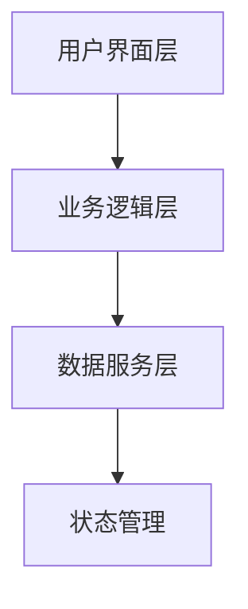
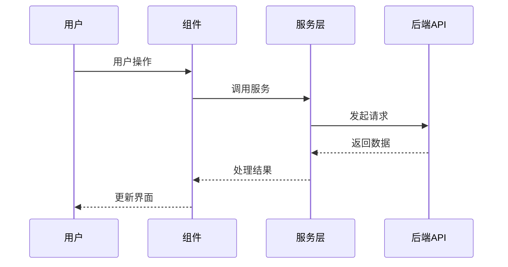
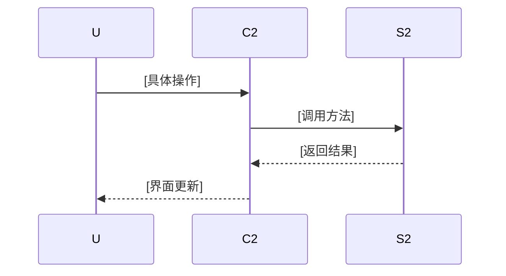

# [功能名称] 技术方案

------禁止调整，保持原样------
> **For Claude:** REQUIRED SUB-SKILL: Use wmb-subagent-driven-development to implement this plan task-by-task.


------禁止调整，保持原样------

**基于需求**: [DRAFT_SPEC.md 文件路径]

**Goal:** [One sentence describing what this builds]

**Architecture:** [2-3 sentences about approach]

**Tech Stack:** [Key technologies/libraries]

---

## 功能点索引

1. **[功能点1名称]** - [一句话方案描述] → [详见实施步骤]([功能点1名称].md)
2. **[功能点2名称]** - [一句话方案描述] → [详见实施步骤]([功能点2名称].md)

## 技术架构

### 需求架构（描写与本需求相关的架构）


### 需求数据流时序（描写与本需求相关的架构）


### 技术栈
- **前端框架**: [框架名称]
- **状态管理**: [状态管理方案]
- **UI组件库**: [组件库名称]

### 目录结构
```
src/
├── components/[FeatureName]/
├── services/[featureName]Service.ts
├── hooks/use[FeatureName].ts
└── types/[featureName].ts
```

## 功能点方案

> **注意**: 每个功能点的详细实施步骤都在独立的子文档中

### [功能点1名称]
**技术方案**: [大致的技术实现思路，2-3句话]
**主要组件**: [涉及的核心组件]
**关键文件**: [主要影响的文件]

**时序图**:


**详细实施**: [详见 [功能点1名称].md]([功能点1名称].md)

### [功能点2名称]
**技术方案**: [大致的技术实现思路，2-3句话]
**主要组件**: [涉及的核心组件]
**关键文件**: [主要影响的文件]

**时序图**:


**详细实施**: [详见 [功能点2名称].md]([功能点2名称].md)

## 实施顺序

1. **[功能点1]** - [依赖原因]
2. **[功能点2]** - [依赖原因]